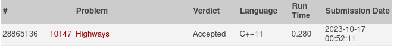

# Highways

The island nation of Flatopia is perfectly flat. Unfortunately, Flatopia has a very poor system of public highways. The Flatopian government is aware of this problem and has already constructed a number of highways connecting some of the most important towns. However, there are still some towns that you can’t reach via a highway. It is necessary to build more highways so that it will be possible to drive between any pair of towns without leaving the highway system.

Flatopian towns are numbered from 1 to N and town i has a position given by the Cartesian
coordinates (xi, yi). Each highway connects exaclty two towns. All highways (both the original ones and the ones that are to be built) follow straight lines, and thus their length is equal to Cartesian distance between towns. All highways can be used in both directions. Highways can freely cross each other, but a driver can only switch between highways at a town that is located at the end of both highways.

The Flatopian government wants to minimize the cost of building new highways. However, they want to guarantee that every town is highway-reachable from every other town. Since Flatopia is so flat, the cost of a highway is always proportional to its length. Thus, the least expensive highway system will be the one that minimizes the total highways length.

## Input

The first line of the input consists of an integer indicating the number of test cases in the input. Then there’s a blank line and the datasets separated by a blank line.

Each test case consists of two parts. The first part describes all towns in the country, and the second part describes all of the highways that have already been built.

The first line of the test case contains a single integer N (1 ≤ N ≤ 750), representing the number of towns. The next N lines each contain two integers, xi and yi separated by a space. These values give the coordinates of i-th town (for i from 1 to N ). Coordinates will have an absolute value no greater than 10000. Every town has a unique location.

The next line contains a single integer M (0 ≤ M ≤ 1000), representing the number of existing highways. The next M lines each contain a pair of integers separated by a space. These two integers give a pair of town numbers which are already connected by a highway. Each pair of towns is connected by at most one highway.

## Output
For each test case write to the output file a single line for each new highway that should be built in order to connect all towns with minimal possible total length of new highways. Each highway should be presented by printing town numbers that this highway connects, separated by a space.

If no new highways need to be built (all towns are already connected), then the output file should contain a line with the sentence ‘No new highways need’.

Print a blank line between test cases.

### Example  
#### Input:  
1

9  
1 5  
0 0  
3 2  
4 5  
5 1  
0 4  
5 2  
1 2  
5 3  
3  
1 3  
9 7  
1 2  
#### Output:  
1 6  
3 7  
4 9  
5 7  
8 3  
## Resultado

## Explicação do codigo

A explicação pode ser encontrada clicando [Aqui!]()  
O vídeo também pode ser encontrado na pasta "Assets" do repositório!

## Referência

O exercício se encontra no link abaixo:
- [Online Judge](https://onlinejudge.org/index.php?option=com_onlinejudge&Itemid=8&page=show_problem&problem=1088)