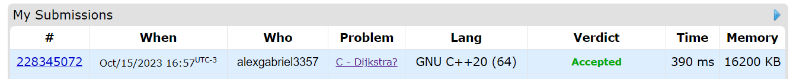
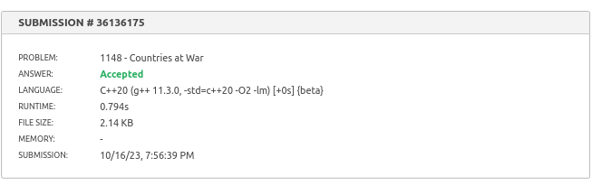

# Exercicios Online

**Número da Lista**: X 
**Conteúdo da Disciplina**: Grafo 2 

## Alunos
|Matrícula | Aluno |
| -- | -- |
| 20/0056603 |  Alex Gabriel Alves Faustino      |
| 18/0022512 |  Lucas de Lima Spinosa dos Santos |

## Sobre 

Neste repositório estão 3 questões sobre o conteúdo do módulo de Grafos 2. O código fonte das questões, juntamente com maiores detalhes a respeito das mesmas (como o enunciado, por exemplo), se encontram nas pastas.

## Screenshots

## Instalação 
**Linguagem**: C++ 

## Uso 

Para rodar o código fonte, use o compilador GCC, gerando um arquivo executável a partir do código fonte, conforme o exemplo fictício abaixo.

    g++ arquivoExecutavel -o arquivoCodigoFonte.cpp

    ./arquivoExecutavel.exe

Caso queira carregar casos de teste presentes em um arquivo .txt, execute o arquivo de saída da compilação passando o .txt como entrada:

    ./arquivoExecutavel.exe < testes.txt 
